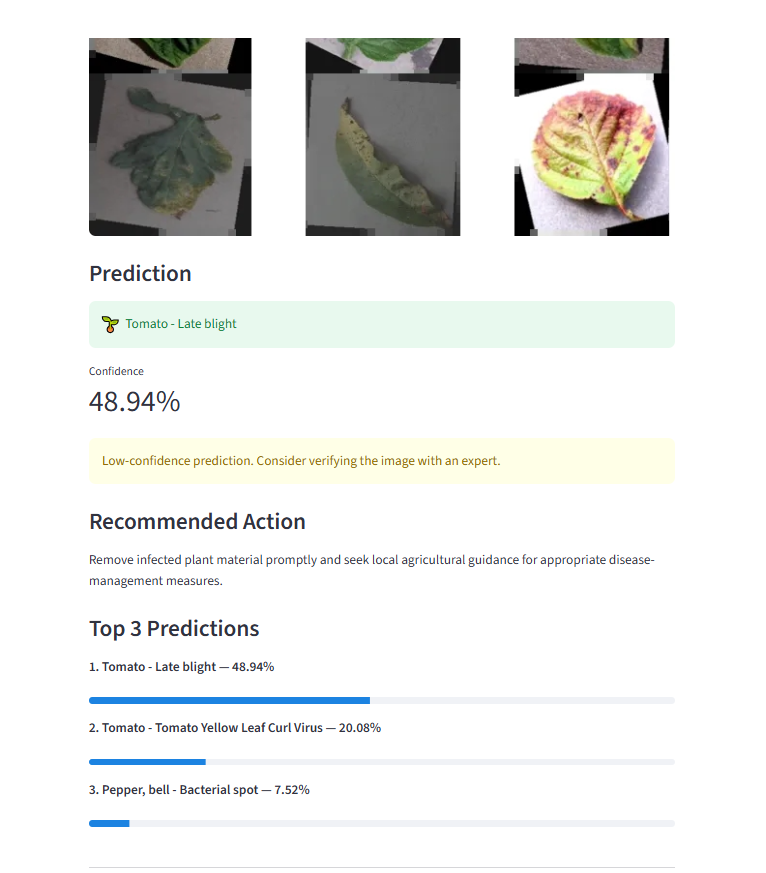

# 🌿 Plant Disease Detection Using Deep Learning

A deep learning-based plant disease detection system that classifies plant leaf images into 38 disease and healthy classes using a MobileNetV2-based image classification model trained on the PlantVillage dataset.

The project includes model training, evaluation, confusion-matrix analysis, and a Streamlit web application for image-based prediction.

---

## 📌 Project Overview

Plant diseases can significantly affect crop productivity and quality. Early identification can help with timely disease-management decisions.

This project uses transfer learning with **MobileNetV2** to classify plant leaf images into **38 PlantVillage classes**.

The system provides:

- Plant disease classification from leaf images
- Prediction confidence score
- Top 3 predictions
- Recommended action
- Interactive Streamlit web interface
- Model evaluation on a separate test set
- Classification report
- Confusion matrix

---

## 🧠 Model

**Architecture:** MobileNetV2  
**Learning Approach:** Transfer Learning  
**Image Size:** 224 × 224  
**Number of Classes:** 38  
**Framework:** TensorFlow / Keras

The MobileNetV2 feature extractor uses ImageNet weights with a custom classification head for PlantVillage disease classification.

---

## 📊 Dataset

The project uses the **PlantVillage** dataset through Hugging Face.

**Dataset:** `geraldmc/plantvillage-full`

### Dataset Details

- Total images: **54,304**
- Number of classes: **38**
- Training images: **43,356**
- Test images: **10,948**
- Image format: RGB
- Original image size: 256 × 256

The test set was kept separate and used for final model evaluation.

---

## 📈 Results

### Final Test Performance

| Metric | Result |
|---|---:|
| Test Accuracy | **92.52%** |
| Test Images | **10,948** |
| Correct Predictions | **10,129** |
| Incorrect Predictions | **819** |
| Macro F1-Score | **0.9075** |
| Weighted F1-Score | **0.9241** |

### Validation Performance

The trained model achieved a validation accuracy of:

**93.25%**

---

## 🔍 Evaluation

The project includes:

- Classification report
- Precision
- Recall
- F1-score
- Confusion matrix

Generated evaluation files:

```text
models/classification_report.txt
models/confusion_matrix.png
```

---

## 🌐 Live Demo

🚀 **Try the deployed application:**

[Plant Disease Detection - Live Demo](https://plant-disease-detection-ncmht9q7wvxwh3tjddjqjka.streamlit.app)

---

## 🌐 Streamlit Web Application

The project includes an interactive web application built with Streamlit.

The application allows users to:

1. Upload a plant leaf image
2. Preprocess the image
3. Predict the most likely plant condition
4. View the prediction confidence
5. View the top 3 predictions
6. View a recommended action

### Supported Image Formats

- JPG
- JPEG
- PNG
- WEBP

### Run the Application

Activate the virtual environment:

```bash
venv\Scripts\activate
```

Run Streamlit:

```bash
streamlit run app.py
```

The application will open locally in your browser.

---

## ⚙️ Installation

Clone the repository:

```bash
git clone https://github.com/yogithasrikari/Plant-Disease-Detection.git
```

Move into the project directory:

```bash
cd Plant-Disease-Detection
```

Create a virtual environment:

```bash
py -3.14 -m venv venv
```

Activate it:

```bash
venv\Scripts\activate
```

Install the required packages:

```bash
pip install -r requirements.txt
```

---

## 📁 Project Structure

```text
Plant-Disease-Detection/
│
├── app.py
├── README.md
├── requirements.txt
├── .gitignore
│
├── screenshots/
│   └── plant-disease-app.png
│
├── models/
│   ├── plant_disease_model.keras
│   ├── plant_disease_model_final.keras
│   ├── classification_report.txt
│   └── confusion_matrix.png
│
└── src/
    ├── prepare_data.py
    ├── data_pipeline.py
    ├── check_dataset.py
    ├── train_model.py
    ├── train_model_quick.py
    ├── evaluate_model.py
    └── confusion_matrix.py
```

---

## 🚀 Workflow

```text
PlantVillage Dataset
        ↓
Data Preparation
        ↓
Image Preprocessing
        ↓
MobileNetV2 Transfer Learning
        ↓
Model Training
        ↓
Validation
        ↓
Test Evaluation
        ↓
Classification Report + Confusion Matrix
        ↓
Streamlit Deployment
        ↓
Plant Disease Prediction
```

---

## 🛠️ Technologies Used

- Python
- TensorFlow
- Keras
- MobileNetV2
- NumPy
- Pandas
- Scikit-learn
- Matplotlib
- Pillow
- OpenCV
- Streamlit
- Hugging Face Datasets
- Git
- GitHub

---

## 🖥️ Application Demo



---

## 📌 Important Note

This project is intended for **educational and research purposes**.

Predictions should be verified with appropriate agricultural expertise before making real-world crop-management decisions.

---

## 👩‍💻 Author

**Yogitha Srikari**

GitHub:  
https://github.com/yogithasrikari